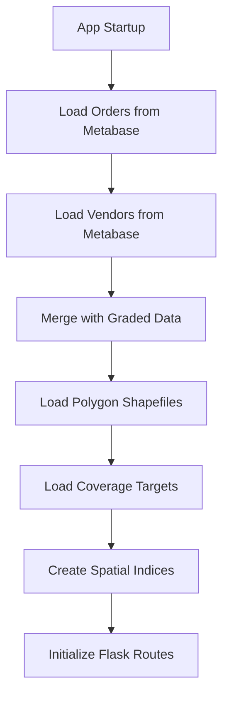
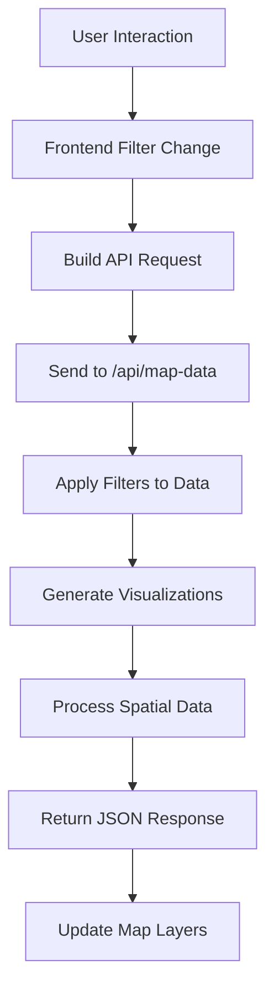

# Map Dashboard

A comprehensive geospatial analytics dashboard for visualizing and analyzing food delivery vendor data, customer orders, and market coverage across multiple Iranian cities. Built with Flask, Leaflet.js, and real-time Metabase integration.
## Overview

The Tapsi Food Map Dashboard provides real-time geospatial analytics for food delivery operations across Tehran, Mashhad, and Shiraz. It integrates with Metabase to fetch live operational data and provides interactive visualizations for business intelligence and operational optimization.

## 🌟 Features

### Core Visualization
- **Interactive Map**: Leaflet.js-powered map with vendor markers, radius visualization, and polygon overlays
- **Multiple Heatmaps**: Order density, organic/non-organic orders, user density, and population heatmaps
- **Coverage Analysis**: 200m grid-based coverage analysis with target-based performance metrics
- **Polygon Overlays**: Marketing areas, Tehran districts, and administrative boundaries

### Advanced Analytics
- **Real-time Data**: Live data from Metabase with optimized parallel fetching
- **Smart Filtering**: Multi-dimensional filtering by business line, grades, status, areas, and time ranges
- **Performance Metrics**: Vendor performance against targets with color-coded visualization
- **Adaptive Rendering**: Zoom-level dependent heatmap optimization and point aggregation

### Technical Features
- **Responsive Design**: Mobile-friendly interface with adaptive controls
- **Caching System**: Intelligent caching for coverage calculations and spatial queries
- **Error Handling**: Robust error handling with graceful fallbacks
- **Production Ready**: Optimized for both development and production deployment

## 📁 Project Structure

```
tapsi-food-map/
│
├── 📄 app.py                          # Main Flask application
├── 📄 mini.py                         # Metabase data fetcher with parallel processing
├── 📄 run_production.py               # Production server runner (Windows/Linux)
├── 📄 requirements.txt                # Python dependencies
├── 📄 README.md                       # This file
│
├── 📁 public/                         # Frontend assets
│   ├── 📄 index.html                  # Main HTML interface
│   ├── 📄 script.js                   # Frontend JavaScript logic
│   └── 📄 styles.css                  # CSS styling
│
└── 📁 src/                           # Data sources and configurations
    ├── 📁 polygons/                   # Geospatial polygon data
    │   ├── 📁 tapsifood_marketing_areas/
    │   │   ├── 📄 tehran_polygons.csv
    │   │   ├── 📄 mashhad_polygons.csv
    │   │   └── 📄 shiraz_polygons.csv
    │   └── 📁 tehran_districts/
    │       ├── 📄 RegionTehran_WGS1984.shp
    │       └── 📄 Tehran_WGS1984.shp
    ├── 📁 targets/                    # Business targets and KPIs
    │   └── 📄 tehran_coverage.csv
    └── 📁 vendor/                     # Vendor classification data
        └── 📄 graded.csv
```

## 🚀 Installation & Setup

### Prerequisites
- Python 3.12+
- pip package manager
- Git

### 1. Clone Repository
```bash
git clone <repository-url>
cd tapsi-food-map
```

### 2. Install Dependencies
```bash
pip install -r requirements.txt
```

### 3. Configure Metabase Connection
Edit credentials and question IDs in `config.py`:
```python
METABASE_URL = "https://metabase.ofood.cloud"
METABASE_USERNAME = "your.email@domain.com"
METABASE_PASSWORD = "your_password"
ORDER_DATA_QUESTION_ID = 5822
VENDOR_DATA_QUESTION_ID = 5045
```

### 4. Prepare Data Sources
Ensure the following data files are in place:
- `src/polygons/tapsifood_marketing_areas/*.csv` - Marketing area polygons
- `src/polygons/tehran_districts/*.shp` - Tehran district shapefiles
- `src/targets/tehran_coverage.csv` - Coverage targets by business line
- `src/vendor/graded.csv` - Vendor grade classifications

## 🎮 Usage

### Development Mode
```bash
python app.py
```
Access the dashboard at: `http://127.0.0.1:5001`

### Production Mode
```bash
python run_production.py
```

The production runner automatically detects the operating system and uses:
- **Windows**: Waitress WSGI server
- **Linux/Unix**: Gunicorn with optimal worker configuration

### Docker
A Dockerfile is included for containerized deployments:
```bash
docker build -t map-dashboard .
docker run -p 5001:5001 map-dashboard
```

## 🔄 Project Flow

### 1. Data Loading Pipeline


### 2. Request Processing Flow


### 3. Data Processing Pipeline


## 🛠 API Documentation

### Base URL
- Development: `http://127.0.0.1:5001`
- Production: Configure as needed

### Endpoints

#### `GET /api/initial-data`
Retrieves initial configuration data for frontend filters.

**Response:**
```json
{
  "cities": [{"id": 1, "name": "mashhad"}, ...],
  "business_lines": ["Restaurant", "Cafe", "Bakery", ...],
  "marketing_areas_by_city": {
    "tehran": ["North Tehran", "South Tehran", ...]
  },
  "vendor_statuses": [1, 2, 3, 4, 5],
  "vendor_grades": ["A+", "A", "B", "C", ...]
}
```

#### `POST /api/map-data`
Main endpoint for retrieving filtered map data.

**Query Parameters:**
| Parameter | Type | Description | Default |
|-----------|------|-------------|---------|
| `city` | string | Target city | "tehran" |
| `start_date` | string | Start date (YYYY-MM-DD) | - |
| `end_date` | string | End date (YYYY-MM-DD) | - |
| `business_lines` | array | Selected business lines | [] |
| `vendor_status_ids` | array | Vendor status IDs | [] |
| `vendor_grades` | array | Vendor grades | [] |
| `area_type_display` | string | Polygon display type | "tapsifood_marketing_areas" |
| `heatmap_type_request` | string | Heatmap type | "none" |
| `zoom_level` | float | Map zoom level | 11 |

**Response:**
```json
{
  "vendors": [
    {
      "vendor_code": "abc123",
      "vendor_name": "Restaurant Name",
      "latitude": 35.7219,
      "longitude": 51.3347,
      "business_line": "Restaurant",
      "grade": "A",
      "radius": 3.5
    }
  ],
  "heatmap_data": [
    {"lat": 35.7219, "lng": 51.3347, "value": 85.2}
  ],
  "polygons": {
    "type": "FeatureCollection",
    "features": [...]
  },
  "coverage_grid": [
    {
      "lat": 35.7219,
      "lng": 51.3347,
      "coverage": {"total_vendors": 5, "by_business_line": {...}},
      "target_value": 10,
      "actual_value": 5,
      "performance_ratio": 0.5
    }
  ]
}
```

## 🏗 Technical Architecture

### Backend (Flask)
- **Data Layer**: Pandas/GeoPandas for data manipulation
- **Spatial Processing**: Shapely for geometric operations
- **API Layer**: Flask with CORS support
- **Optimization**: LRU caching, vectorized operations
- **Error Handling**: Comprehensive error handling with fallbacks

### Frontend (Vanilla JS)
- **Map Engine**: Leaflet.js with plugins
- **UI Components**: Custom dropdown, range sliders, toggles
- **State Management**: Centralized state with event-driven updates
- **Responsive Design**: CSS Grid and Flexbox

### Data Sources
- **Real-time Data**: Metabase API with parallel fetching
- **Geospatial Data**: Shapefiles and CSV polygon data
- **Static Data**: Local CSV files for grades and targets

## 🎨 Visualization Types

### 1. Vendor Markers
- **Standard View**: Pin markers with popup information
- **Radius View**: Coverage radius visualization with customizable colors
- **Clustering**: Automatic clustering at low zoom levels

### 2. Heatmaps
- **Order Density**: Aggregate order concentration
- **Organic Orders**: Organic vs non-organic order patterns
- **User Density**: Unique customer distribution
- **Population**: Tehran district population visualization

### 3. Coverage Grid
- **Grid Analysis**: 200m × 200m coverage grid
- **Target Performance**: Color-coded performance against targets
- **Business Line Analysis**: Coverage by specific business lines

### 4. Polygon Overlays
- **Marketing Areas**: TapsiFood operational areas
- **Administrative**: Tehran region and main districts
- **Statistics**: Enriched with vendor counts and user metrics

## ⚙️ Configuration

### Configuration File
All connection details are stored in `config.py` and can be edited directly.

### Performance Tuning
```python
# In config.py
WORKER_COUNT = 10           # Metabase parallel workers
PAGE_SIZE = 100000          # Records per page
CACHE_SIZE = 100           # Coverage cache limit
```

### City Boundaries (Coverage Grid)
```python
city_boundaries = {
    "tehran": {"min_lat": 35.5, "max_lat": 35.85, "min_lng": 51.1, "max_lng": 51.7},
    "mashhad": {"min_lat": 36.15, "max_lat": 36.45, "min_lng": 59.35, "max_lng": 59.8},
    "shiraz": {"min_lat": 29.5, "max_lat": 29.75, "min_lng": 52.4, "max_lng": 52.7}
}
```

## 🔧 Advanced Features

### Adaptive Heatmap System
- **Zoom-based Optimization**: Automatic parameter adjustment
- **Outlier Removal**: Robust statistical methods
- **Smooth Transitions**: Gradual parameter changes during zoom

### Coverage Analysis
- **Vectorized Processing**: High-performance spatial calculations
- **Target Integration**: Business line specific target comparison
- **Caching System**: Intelligent caching for repeated queries

### Spatial Filtering
- **STRTree Indexing**: Efficient point-in-polygon queries
- **Multi-level Districts**: Region and main district support
- **Marketing Area Integration**: Custom business area definitions

## 📊 Performance Optimization

### Backend Optimizations
- **Parallel Data Fetching**: Multi-threaded Metabase queries
- **Spatial Indexing**: STRTree for geometric operations
- **Data Type Optimization**: Categorical data and optimized dtypes
- **Vectorized Operations**: NumPy/Pandas vectorization

### Frontend Optimizations
- **Layer Management**: Efficient Leaflet layer handling
- **Data Aggregation**: Client-side point aggregation
- **Responsive Controls**: Debounced user interactions
- **Memory Management**: Proper cleanup of map resources
